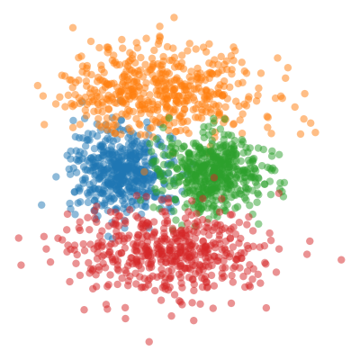

# Implicit Deep Latent Variable Models for Text Generation

This repository contains source code to reproduce the results presented in the paper [Implicit Deep Latent Variable Models for Text Generation](https://arxiv.org/abs/1901.00612) (EMNLP 2019):

```
@inproceedings{Fang_iLVM_2019_EMNLP,
  title={Implicit Deep Latent Variable Models for Text Generation},
  author={Le Fang, Chunyuan Li, Jianfeng Gao, Wei Dong, Changyou Chen},
  booktitle={EMNLP},
  year={2019}
}
```

We present two types of implicit deep latent variable models, **iVAE** and **iVAE_MI**.
Core to these two model variants is the sample-based representation of the latent features in LVMs, in replacement of traditional Gaussian-based distributions. In this repo, each folder corresponds to a specific experiment with different datasets or tasks. To run the code, please go to subfolders for specific experiment. The file named as `train_xxx.py` in each folder is the main code to train and test our implicit VAEs. 

## Contents
There are three steps to use this codebase to reproduce the results in the paper.

1. [Proof-of-Concept on a Toy Dataset ](#Proof-of-Concept-on-a-Toy-Dataset )
2. [Language modeling](#Language-modeling)

    2.1. [Language modeling on PTB](#Language-modeling-on-PTB)
    
    2.2. [Language modeling on Yahoo](#Language-modeling-on-Yahoo)
    
    2.3. [Language modeling on Yelp](#Language-modeling-on-Yelp) 

3. [Style-transfer-on-Yelp](#Style-transfer-on-Yelp) 
4. [Dialog response generation](#Dialog-response-generation ) 

    4.1. [Dialog response generation on Switchboard](#Dialog-response-generation-on-Switchboard)
    
    4.2. [Dialog response generation on DailyDialog](#Dialog-response-generation-on-Dailydial)

# 1. Proof-of-Concept on a Toy Dataset 
The toy dataset contains 4 data points **x**: 4 different one-hot four-dimensional vectors, and we learn the corresponding latent code **z** in 2D space for each **x**. Run the following in cmd lime:
```
cd toy_onehot/
python vae_onehot.py
python train_onehot.py
```
The result is as following:

VAE             |  iVAE
:--------------:|:-------------------------:
  |  

# 2. Language modeling

### 2.1 Language modeling on PTB

After downloading, run
```
cd lang_model_ptb/
python preprocess_ptb.py --trainfile data/train.txt --valfile data/val.txt --testfile data/test.txt --outputfile data/ptb
```
This will create the `*.hdf5` files (data tensors) to be used by the model, as well as the `*.dict` file which contains the word-to-integer mapping for each word.

Specify '--model' in cmd line, with '--model mle' for implicit vae (default if not specified) and '--model mle_mi' for implicit vae with mutual information maximized. The command for training is for example
```
python train_ptb.py
```
The command for evaluation after the 30th epoch is
```
python train_ptb.py --test --train_from results_mle/030.pt
```
The command for training VAEs ('vae', 'beta_vae', 'savae', 'cyc_vae') is for example
```
python train_ptb_vaes.py --model vae
```
For interpolating between 2 sentences after training the 40th epoch, run
```
python interpolation.py
```
For evaluating decoders from prior codes after training and calculate forward & reverse PPL, we need install [KenLM Language Model Toolkit](https://github.com/kpu/kenlm) and run
```
python generative_model.py --model ['mle', 'mle_mi', 'vae','beta_vae', 'savae', 'cyc_vae']
```
### 2.2. Language modeling on Yahoo

After downloading, run
```
cd lang_model_yahoo/
python preprocess_yahoo.py --trainfile data/train.txt --valfile data/val.txt --testfile data/test.txt --outputfile data/yahoo
```
This will create the `*.hdf5` files (data tensors) to be used by the model, as well as the `*.dict` file which contains the word-to-integer mapping for each word.

Specify '--model' in cmd line, with '--model mle' for implicit vae (default if not specified) and '--model mle_mi' for implicit vae with mutual information maximized. The command for training is for example
```
python train_yahoo.py
```
The command for evaluation after the 30th epoch is
```
python train_yahoo.py --test --train_from results_mle/030.pt
```
### 2.3. Language modeling on Yelp

Specify '--model' in cmd line, with '--model mle' for implicit vae (default if not specified) and '--model mle_mi' for implicit vae with mutual information maximized. The command for training is for example
```
python train_yelp.py
```
The command for evaluation after, e.g., the 30th epoch is
```
python train_yelp.py --test --train_from results_mle/030.pt
```
The command for training an autoencoder (AE) is
```
python train_yelp_ae.py
```
The command for training VAEs ('vae', 'beta_vae', 'cyc_vae') is for example
```
python train_yelp_vaes.py --model vae
```
# 3. Style transfer on Yelp
Need [fasttext library](https://pypi.org/project/fasttext/) and [KenLM Language Model Toolkit](https://github.com/kpu/kenlm) for evaluation. Please install beforehand.
The command for training implicit vae with mutual information maximized is 
```
python train_yelp.py
```
The command for training an [adversarially regularized autoencoder](https://arxiv.org/abs/1706.04223) is
```
python arae_train_yelp.py
```
For evaluating the model after training for the 25th epoch, run
```
python train_yelp.py --eval --load_path ./output/ILVM --load_epoch 25
```
# 4. Dialog response generation 

### 4.1. Dialog response generation on Switchboard
Use pre-trained Word2vec: download Glove word embeddings `glove.twitter.27B.200d.txt` from https://nlp.stanford.edu/projects/glove/ and save it to the `./data` folder. The default setting use 200 dimension word embedding trained on Twitter.

The command for training implicit vae with mutual information maximized is 
```
python train_swda.py
```
The command for training [DialogWAE](https://arxiv.org/abs/1805.12352) is
```
python DialogWAE_train_swda.py
```
### 4.2. Dialog response generation on DailyDialog

Use pre-trained Word2vec: download Glove word embeddings `glove.twitter.27B.200d.txt` from https://nlp.stanford.edu/projects/glove/ and save it to the `./data` folder. The default setting use 200 dimension word embedding trained on Twitter.

The command for training implicit vae with mutual information maximized is 
```
python train_dailydial.py
```
The command for training [DialogWAE](https://arxiv.org/abs/1805.12352) is
```
python DialogWAE_train_dailydial.py
```

## Questions?
Please drop us ([Le](https://www.fangleai.com/) or [Chunyuan](http://chunyuan.li/)) a line if you have any questions.


